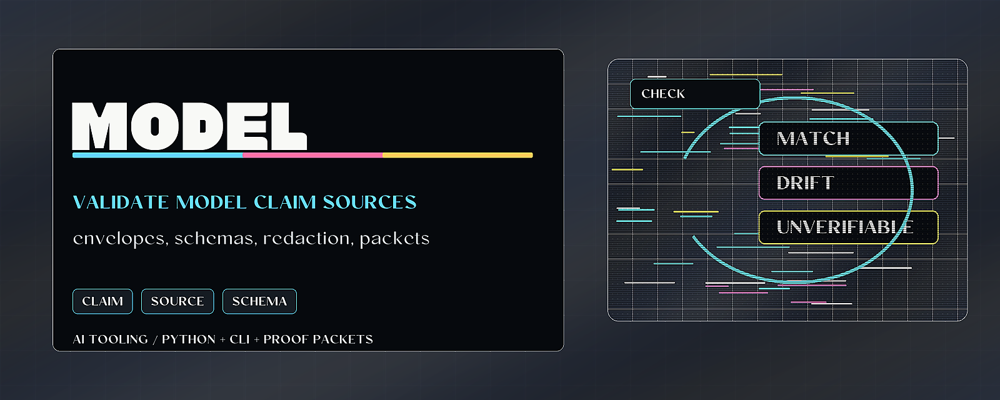

# Model Provenance Validator



> Validate model and release claims against small provenance envelopes.

Model Provenance Validator checks the JSON envelope that says what a claim is
about, where its source came from, when it was retrieved, and what validation
status can be published. It redacts credential-shaped values from its own output.

## Why it matters

Model cards, README claims, release notes, and agent reports become fragile when
source references are informal. This tool makes the reference shape explicit
enough to validate, summarize, and hand off.

## Try it

```bash
python -m pip install -e ".[test]"
model-provenance-validator examples/envelopes/release.provenance.json
python -m pytest
```

## What to test first

- Validate `examples/envelopes/release.provenance.json`.
- Run `model-provenance-validator *.provenance.json --summary --json`.
- Emit a proof packet with `--proof-packet`.

## Current status

Python package and CLI with proof-surface integration. It validates envelope
shape and report hygiene; it does not certify the underlying claim.

## Existing technical notes

> Validate provenance envelopes; redact secret-shaped values out of its own output.

[](LICENSE)


[](https://github.com/HarperZ9/model-provenance-validator/actions/workflows/ci.yml)
[](https://harperz9.github.io)

`model-provenance-validator` keeps model and release claims attached to small,
checkable provenance envelopes. It validates the JSON shape that says what the
claim is about, where the reference came from, when it was retrieved, and what
validation status a maintainer is willing to publish.

The package includes a small schema validator for the envelope shape used by
the CLI. Its one runtime dependency is `proof-surface`, the shared package that
owns the proof-surface packet contract emitted by `--proof-packet`.

Use it when a README, report, model-card note, release packet, or AI workflow
claim needs a source reference before the claim is repeated publicly.

## Install

```bash
python -m pip install model-provenance-validator
```

For local development:

```bash
python -m pip install -e ".[test]"
python -m pytest
```

## Usage

See [USAGE.md](USAGE.md) for an install line, the full CLI/API surface, and
worked examples with expected output.

```bash
model-provenance-validator envelope.json
model-provenance-validator envelope.json --json
model-provenance-validator *.provenance.json --summary
model-provenance-validator *.provenance.json --summary --json
model-provenance-validator *.provenance.json --proof-packet
model-provenance-validator *.provenance.json
```

The command exits with status `1` when any envelope fails validation. Malformed
or unreadable envelope files are reported as invalid results so batch runs can
continue and produce a complete action list. Result paths are printed relative
to the current directory when possible, and validation messages redact
credential-shaped strings and local absolute paths.

Use a custom schema:

```bash
model-provenance-validator envelope.json --schema schema.json
```

Run the bundled example:

```bash
model-provenance-validator examples/envelopes/release.provenance.json
```

## Envelope shape

Required top-level fields:

- `envelope_version`
- `subject`
- `source`
- `references`
- `validation`

Allowed `source.kind` values:

- `official-doc`
- `paper`
- `release-note`
- `local-fixture`
- `other`

Allowed `validation.status` values:

- `verified`
- `partial`
- `unknown`

Each `references[].retrieved_at` value must use `YYYY-MM-DD` date shape and be
a valid calendar date.

## Minimal valid envelope

```json
{
  "envelope_version": "1",
  "subject": "public-surface-sweeper README claim",
  "source": {
    "name": "public-surface-sweeper README",
    "kind": "release-note"
  },
  "references": [
    {
      "name": "Repository README",
      "locator": "https://github.com/HarperZ9/public-surface-sweeper",
      "retrieved_at": "2026-06-13"
    }
  ],
  "validation": {
    "status": "verified",
    "notes": "Claim checked against the public README surface."
  }
}
```

## Example text output

```text
release.provenance.json: valid
draft.provenance.json: invalid
  $.references: expected at least 1 item(s)
```

## Example JSON output

```json
[
  {
    "path": "release.provenance.json",
    "valid": true,
    "errors": []
  }
]
```

## Example summary output

```text
total: 3
valid: 2
invalid: 1
error_count: 1
action_items:
- draft.provenance.json: resolve 1 validation error(s)
```

## Proof-surface packet output

Use `--proof-packet` when provenance validation should feed `repo-proof-index`
or a release-readiness report. The packet follows the shared proof-surface
interop shape: claims, checks, and action items in one JSON object. The generated
packet is self-checked before printing so producer drift fails before entering
the pipeline.

```bash
model-provenance-validator *.provenance.json --proof-packet > provenance.packet.json
repo-proof-index provenance.packet.json --summary
```

## What it validates

- required fields;
- JSON object and array shape;
- non-empty string fields where required;
- exact constants such as `envelope_version: "1"`;
- enum values for source kind and validation status;
- string pattern constraints such as `references[].retrieved_at`;
- calendar-date validation for `references[].retrieved_at`;
- unexpected fields when `additionalProperties` is false.

## What it does not do

- It does not fetch the referenced source.
- It does not decide whether the underlying claim is true.
- It does not prove a model is safe.
- It does not certify provenance.
- It does not replace human review of the referenced material.

## Release-readiness use

`model-provenance-validator` is the provenance-envelope point in a proof-surface
pipeline:

```text
claim -> source reference -> provenance envelope -> validation result -> proof index
```

Its job is to keep model/reference claims from floating without a source,
retrieval date, and validation status.

---
**Zain Dana Harper** — small tools with explicit edges.
[Portfolio](https://harperz9.github.io) · [HarperZ9](https://github.com/HarperZ9)
<sub>Built with Claude Code; reviewed, tested, and owned by me.</sub>

## For developers

Keep the public README, package metadata, and examples aligned with current behavior. Before opening a PR or pushing a release, run the local package verification path.

```bash
python -m pip install -e ".[test]"
python -m pytest
```
